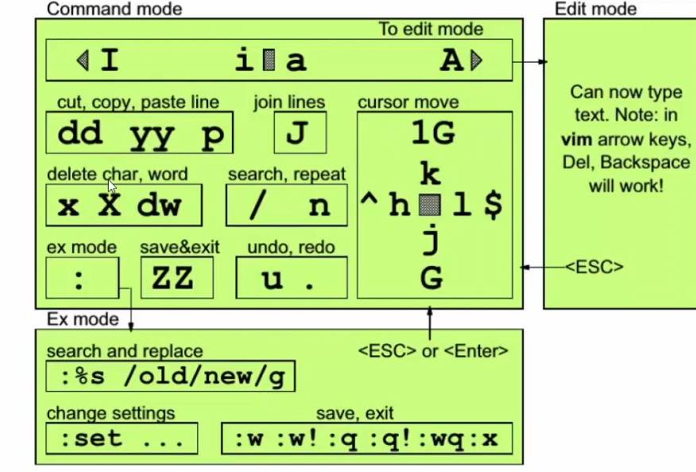
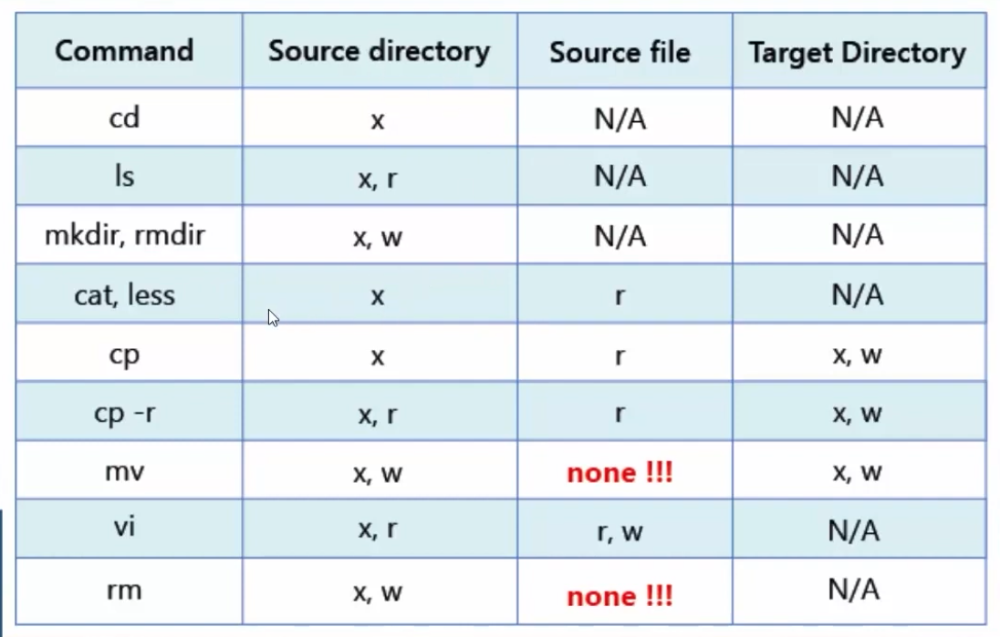
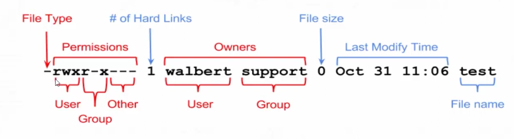
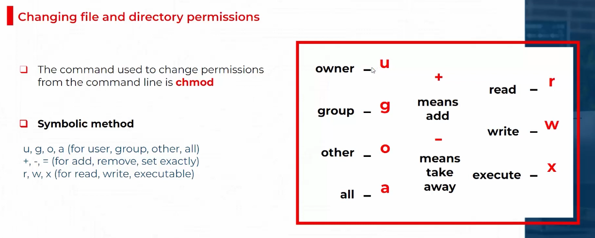

# 🐧 Red Hat System Administration I (RH124) — Learning Journal  
Student: Omar Mazen  
Field: Computer Engineering — Cybersecurity  
Goal: Documenting my progress and hands-on practice while learning RHEL 9  

 

## CH01 — Install RHEL 9 Step by Step

###  Install RHEL 9   
> 
---

## CH02 — Accessing the Command Line
### Lesson 1 — Intro  
>Introduction to the Linux command line (CLI). It’s the main way to interact with the system, letting you control almost everything using simple commands.
### Lesson 2 — What is Bash Shell
>Bash is the program that executes the commands you type in the terminal. It interprets your input so the system can understand and run it.
### Lesson 3 — Command Syntax
>Every Linux command has a structure: command [options] [arguments].
Example: ls -l /home lists files in detail.
### Lesson 4 — How to Access the CLI
>You can open the terminal via the application or Ctrl+Alt+T. You can work as a regular user or as root depending on what you need.
### Lesson 5 — Date, Passwd and File Commands
>Important commands: date shows the current date/time, passwd changes your password, ls, cp, mv, rm manage files.
### Lesson 6 — Cat vs Less vs Head and Tail
>cat shows the whole file, less shows it page by page, head shows the first 10 lines, tail shows the last 10 lines and can follow updates.
### Lesson 7 — History Command
>history shows your previously executed commands, useful for repeating or reviewing commands.
### Lesson 8 — Shell Shortcuts
>Key shortcuts: Ctrl+C stops a running command, Ctrl+R searches command history, Tab auto-completes commands or filenames.
> 
```BASH
hat@192:~$ ls | grep my
myfoldeer
myfoldeesr
myfolder
hat@192:~$ mkdir myF\
> cd myF\
> touch F1.txt F2.txt
hat@192:~$ 

```
---

## CH03 — Managing Files From the Command Line
### Lesson 1 — Access Linux File System  
> 
### Lesson 2 — Major Directories  

| **Path** | **Description**|
| -------- | ---------- |
| `/`      | Root directory, contains essential files for booting and other filesystems mounted as subdirectories. |
| `/bin`   | Essential command binaries.|
| `/boot`  | Bootloader, kernel, and files needed to boot Linux.|
| `/dev`   | Device files for accessing hardware devices.|
| `/etc`   | Local system configuration files and installed application configs.|
| `/home`  | Users' personal directories.|
| `/lib`   | Shared libraries required for system boot.|
| `/media` | Mount point for external removable media (USB, CD, etc.).|
| `/mnt`   | Temporary mount point for filesystems.|
| `/opt`   | Optional files, like third-party tools.|
| `/root`  | Root user's home directory.|
| `/sbin`  | System administration executables.|
| `/tmp`   | Temporary files, usually cleared on boot.|
| `/usr`   | User applications, binaries, libraries, and man files.|
| `/var`   | Variable data like logs, emails, web files, cron jobs, etc.|

### Lesson 3 — Linux File Types  
| **Symbol** | **Meaning**                                        |
| ---------- | --------- |
| `-`        | Regular file|
| `d`        | Directory|
| `l`        | Symbolic link (shortcut)|
| `c`        | Character device file (in `/dev`)|
| `b`        | Block device file (e.g., hard drives, disk images) |
| `s`        | Socket      |
| `p`        | Named pipe (FIFO)           |


### Lesson 4 — Naming Rules  
| **Linux File Names** | **Should**                                 | **Should Not**                              |
| -------------------- | -------------------------------------------- | --------------------------------------------------|
| Naming rules | Be descriptive| Include embedded blanks|
| Characters | Only alphanumeric characters (UPPERCASE, lowercase, numbers, @, _) | Contain shell metacharacters `* ? > < / ; & ! [ ] \ ‘ “ ( ) { }` |
| Case sensitivity| Are case sensitive| —|
| Hidden files| Filenames starting with `.` are hidden|—|
| Length| Maximum number of characters for a filename is 255| —|

### Lesson 5 — Absolute vs Relative Path  
> 
### Lesson 6 — LS Command  
| **Option**  | **Description**                                                                                                                      |
| ----------- | ------------------------------------------------------------------------------------------------------------------------------------ |
| `-l`        | Long list format. Shows file permissions, number of links, owner, group, file size, last modification time, and file/directory name. |
| `-lh`       | Long list format with **human-readable file sizes** (e.g., KB, MB).                                                                  |
| `-r`        | Lists files in **reverse order**.                                                                                                    |
| `-a`        | Shows **all files**, including hidden files (those starting with `.`).                                                               |
| `-ltr`      | Combines options: **long format, sort by time**, and **reverse order**. Shows the latest modifications last.                         |
| `-F`        | Adds a **trailing `/` for directories**, `*` for executable files, etc.                                                              |
| `-lS`       | Long format, **sorted by size** (largest to smallest).                                                                               |
| `-R`        | Recursively lists **all directories and subdirectories**.                                                                            |
| `-i`        | Displays **inode numbers** beside files and directories.                                                                             |
| `dir`        | The dir command is similar to `ls` and can be used in Linux to list files and directories. It supports the same options as `ls`.    |
| `man ls`    | Opens the **manual page** for `ls`, showing all options and details.                                                                 |

> 
### Lesson 7 — Managing Files  
|ACTIVITY | COMMAND SYNTAX |
|-|-|
|Create a directory | mkdir directory|
|Copy a file|`cp file new-file`|
|Copy a directory and its contents|`cp -r directory new-directory`|
|Move or rename a file or directory|`mv file new-file`|
|Remove a file|`rm file`|
|Remove a directory containing files|`rm -r directory`|
|Remove an empty directory|`rmdir directory`| 
### Lesson 8 — Create & Copy Files  


 **File Creation Commands**

| **Command**                 | **Explanation**                                                                                                            |
| --------------------------- | -------------------------------------------------------------------------------------------------------------------------- |
| `touch file1 File1`         | Creates **two files** — `file1` and `File1`. Because Linux is **case sensitive**, they are treated as **different files**. |
| `touch /root/Desktop/file1` | Creates a file named `file1` inside `/root/Desktop`. Requires **root permissions**.                                        |
| `touch {file,file1,fil2}`   | Creates **three files**: `file`, `file1`, and `fil2`. The `{}` are used for **brace expansion**.                           |


 **Directory Creation Commands**

| **Command**               | **Explanation**                                                                                                                                          |
| ------------------------- | -------------------------------------------------------------------------------------------------------------------------------------------------------- |
| `mkdir dir1 Dir2`         | Creates two directories: `dir1` and `Dir2` (again, case sensitive).                                                                                      |
| `mkdir -p dir1/dir2/dir3` | Creates a **nested directory structure** — if `dir1` and `dir2` don’t exist, they will be created automatically thanks to the **`-p` (parents)** option. |
| `mkdir 'system admin'`    | Creates a directory named **system admin** (with a space in the name). Quotes are used to treat the space as part of the name.                           |
| `mkdir system\ admin`     | Does the **same thing** as above — the backslash `\` escapes the space.                                                                                  |


 **Copy Commands**

| **Command**                    | **Explanation**                                                                     |
| ------------------------------ | ----------------------------------------------------------------------------------- |
| `cp -r /dir /home/hat/Desktop` | Recursively (**`-r`**) copies the entire `/dir` directory into `/home/hat/Desktop`. |
| `cp -r /dir .`                 | Copies `/dir` into the **current directory** (`.` means current directory).         |
| `cp -r /dir ~hat`              | Copies `/dir` into the **home directory of user `hat`** (`~hat` means `/home/hat`). |


### Lesson 9 — Move & Remove Files  
| **Command**| **Explanation**|
| -------------------------- | ------ |
| `mv dir /home/hat/Desktop` | Moves the directory **`dir`** to `/home/hat/Desktop`.|
| `mv dir .`| Moves the directory **`dir`** to the **current directory** (`.`). If it’s already there, nothing happens.|
| `mv dir ~hat`| Moves the directory **`dir`** to the **home directory** of user `hat`.|
| `mv file1 File1 ..` | Moves **`file1`** and **`File1`** to the **parent directory** (`..`).|
| `rm -rf dir`  | Forcefully and recursively removes the **directory `dir`** and all its contents. ⚠️ This action **cannot be undone**. |
 
### Lesson 10 — Hard Links vs Soft Links  
| 🧱 Hard link | another name for the same file (`same data`).|
|-|-|
| 🔗 Soft link | a pointer or `shortcut` to the original file.|

```markdown
Every file is a hard link to its inode.
Creating more hard links just adds additional names pointing to the same inode and data.
```

### Lesson 11 — Linux Inodes  

An **inode** (index node) is a **data structure** used by the Linux filesystem to **store all information about a file or directory except its name**.
Each file or directory has a unique **inode number** that identifies it within the filesystem.

| **Field (Metadata)**        | **Description**|
| -------------------- | --------- |
| **Inode number**            | Unique ID assigned to each file within a filesystem.|
| **File type**               | Indicates if it’s a regular file, directory, symbolic link, etc.|
| **Permissions**             | File access rights (read, write, execute for user/group/others).|
| **Owner (UID)**             | User ID of the file owner.|
| **Group (GID)**             | Group ID associated with the file.|
| **File size**               | The size of the file in bytes.|
| **Timestamps**              | Includes: <br> - **atime** (last access time) <br> - **mtime** (last modification time) <br> - **ctime** (last status change time). |
| **Link count**              | Number of hard links pointing to the inode.|
| **Pointers to data blocks** | Addresses of the actual data blocks on the disk where file contents are stored.|
| **Flags**                   | Extra info like immutability or append-only status.|
 
### Lesson 12 — Creating Links (Part 1)  

```bash
ln -s file1 Slink1     # Creates a soft link   file and dirctor
ln file1 Hlink2        # Creates a hard link   only file
```
### Lesson 13 — Creating Links (Part 2)  
| **Type**| **Can link to**| **Restrictions / Notes**|
| - | - | - |
| **Soft Link (Symbolic Link)** | Files **and directories**| Can link across **different partitions or filesystems**. If the original is deleted, the link **breaks**.|
| **Hard Link**| **Files only** (not directories, except in rare cases for system use) | Must be on the **same partition/filesystem**. Points directly to the **inode**. Deleting the original file does **not** break the link. |

### Lesson 14 — Pattern Matching  
> ########################################################################################################################################################################################################################################################################################################################################################[practice]###############################################################################################################################################################################################################################################################################################################################################################
| PATTERN | MATCHES |
| :--- | :--- |
| `*` | Any string of zero or more characters. |
| `?` | Any single character. |
| `[abc...]` | Any one character in the enclosed class (between the square brackets). |
| `[!abc...]` | Any one character **not** in the enclosed class. |
| `[^abc...]` | Any one character **not** in the enclosed class. |
| `[[:alpha:]]` | Any alphabetic character. |
| `[[:lower:]]` | Any lowercase character. |
| `[[:upper:]]` | Any uppercase character. |
| `[[:alnum:]]` | Any alphabetic character or digit. |
| `[[:punct:]]` | Any printable character not a space or alphanumeric. |
| `[[:digit:]]` | Any single digit from 0 to 9. |
| `[[:space:]]` | Any single white space character. This may include tabs, newlines, carriage returns, form feeds, or spaces. |

### Lesson 15 — Regular Expressions with Grep  
| Symbol | Description |
| :--- | :--- |
| `.` | replaces any character |
| `^` | matches start of string |
| `$` | matches end of string |
| `*` | matches up zero or more times the preceding character |
| `\` | Represent special characters |
| `{}` | Groups regular expressions (In BRE, often used as `\ {}`) |
| `?` | Matches up exactly one character (In BRE, often used as `\ ?`) |
### Lesson 16 — Grep Command  
| Command | Basic Regular Expression (BRE) | Matches (Example) | Description |
| :--- | :--- | :--- | :--- |
| `grep cat /usr/share/dict/words` | `cat` | Any line containing the substring **`cat`** anywhere (e.g., `c**at**`, `c**at**tle`, `lo**cat**ion`). | Simple search for a literal string. |
| `grep ^cat /usr/share/dict/words` | `^cat` | Any line that **starts** with the string **`cat`** (e.g., **`cat`**, **`cat**egory`). | Uses **`^`** to anchor the match to the **start of the line**. |
| `grep cat$ /usr/share/dict/words` | `cat$` | Any line that **ends** with the string **`cat`** (e.g., `wild**cat**`, **`cat`**). | Uses **`$`** to anchor the match to the **end of the line**. |
| `grep ^cat$ /usr/share/dict/words` | `^cat$` | The line containing the word **`cat`** **only**. | Matches the entire line exactly with the specified string. |
| `grep c.t /usr/share/dict/words` | `c.t` | Any line containing `c` followed by **any single character** (represented by `.`), followed by `t` (e.g., **`cat`**, **`cut`**, **`c1t`**). | Uses **`.`** (dot) to match any single character. |
| `grep ^c.t$ /usr/share/dict/words` | `^c.t$` | Any three-letter word starting with **`c`** and ending with **`t`** (e.g., **`cat`**, **`cut`**, **`cot`**). | Combines start/end anchors with the single-character wildcard. |
| `grep c[aou]t /usr/share/dict/words` | `c[aou]t` | Any line containing `c` followed by **`a` or `o` or `u`**, followed by `t` (matches **`cat`**, **`cot`**, **`cut`**). | Uses **`[]`** to match a single character from a specific set. |
| `grep ^c[aou]t$ /usr/share/dict/words` | `^c[aou]t$` | Only the three-letter words: **`cat`**, **`cot`**, or **`cut`**. | Combines anchors with the character set. |
| `grep -e cat -e tele /usr/share/dict/words` | `cat` or `tele` | Any line containing **`cat`** **OR** **`tele`**. | Uses the **`-e`** option to specify **multiple patterns** (OR logic). |
| `grep -l ericsson /etc/passwd` | `ericsson` | Displays **`/etc/passwd`** **only** if the string `ericsson` is found within it. | Uses the **`-l`** option to show **filename only** (silent match). |
| `ps aux \| grep ^root` | `^root` | Lines that **start** with the string **`root`** in the output of the `ps aux` command. | Filters the output of `ps aux` using a **pipe** (`|`). |
### Lesson 17 — Cut and Tr Commands  

```bash
-# CUT command examples

cut -f 1 -d : /etc/passwd # Extract the first field (usually username) from /etc/passwd using ':' as delimiter
cut -c 1-7 /etc/passwd    # Extract characters from column 1 to 7 from each line of /etc/passwd
cut -c 25- /etc/passwd    # Extract all characters from column 25 to the end from each line of /etc/passwd

-# TR command examples

echo hello world | tr a-z A-Z                        # Convert lowercase letters to uppercase
echo hello world | tr [:lower:] [:upper:]            # Another way to convert lowercase to uppercase using character classes
echo "Welcome To Linux" | tr [:space:] '\t'          # Replace spaces with tabs
echo "Welcome To Linux" | tr -d 'W'                  # Delete the character 'W' from the string
echo "my ID is 73535" | tr -d [:digit:]              # Delete all digits from the string
```


---

## CH04 — Getting Help in RHEL
### Lesson 1 — Intro  
> The goal in the chapter is "Resolve problems by using local help systems" refers to using the documentation and help files built into the Linux operating system.
### Lesson 2 — Manual Pages Overview  
Linux Man Page Sections and Their Functions
| **Section Number** | **Content Type / Function**                                                                                                                 |
| ------------------ | ------------------------------------------------------------------------------------------------------------------------------------------- |
| **1**              | **User commands** – Executable programs and shell commands that users can run. Example: `ls`, `mkdir`.                                      |
| **2**              | **System calls** – Functions provided by the kernel, callable from user space. Example: `open()`, `read()`.                                 |
| **3**              | **Library functions** – Functions provided by program libraries. Example: `printf()`, `malloc()`.                                           |
| **4**              | **Special files / Devices** – Device files found in `/dev`. Example: `/dev/null`, `/dev/sda`.                                               |
| **5**              | **File formats** – Configuration and data file formats. Example: `/etc/passwd`, `/etc/fstab`.                                               |
| **6**              | **Games** – Historical section for games and entertainment programs. Example: `robots`, `fortune`.                                          |
| **7**              | **Conventions, standards, and miscellaneous** – Protocols, standards, file system conventions. Example: `hier(7)` for filesystem hierarchy. |
| **8**              | **System administration and privileged commands** – Commands for system maintenance, usually requiring root. Example: `fsck`, `mount`.      |
| **9**              | **Kernel routines / Linux kernel API** – Internal kernel calls, not normally used by standard users. Example: `sched_setscheduler()`.       |


### Lesson 3 — man Command  
```bash
# MAN Page Command Examples

# View the manual page for the mkdir command (default Section 1)
man mkdir       # Section 1: User commands

# Perform a keyword search across all manual pages
man -K passwd   # Searches for the keyword "passwd" in all sections

# View the manual page for the passwd command (Section 1)
man 1 passwd    # Section 1: User commands

# View the manual page for the /etc/passwd file format (Section 5)
man 5 passwd    # Section 5: File formats
 [[[[[you need :1,4,5,9 ]]]]] in /share/man in default open section 1 
``` 
### Lesson 4 — Search Patterns in Manual Pages  
```bash
# Perform a keyword search across the descriptions of all manual pages
man -K "print files"  # This is equivalent to using apropos "print files"
```
### Lesson 5 — Other Ways to Get Help  
| **Method**| **Command / Link**| **Description**|
| - | - | - |
| **Man pages**| `man command_name`| Opens the manual page for the specified command.|
| **--help option**| `command_name --help`| Displays a concise summary of the command’s options and usage.|
| **Red Hat Documentation**| `https://docs.redhat.com`| Official primary source for Red Hat product documentation.|
| **Red Hat Access Documentation**| `https://access.redhat.com/documentation/en/` | Documentation available via the Red Hat Customer Portal.|
| **The Linux Documentation Project (TLDP)** | `http://tldp.org/`| General Linux guides, HOWTOs, and manuals maintained by the open-source community. |


## CH05 — Creating, Viewing, and Editing Text Files
### Lesson 1 — Intro  
> introduction >> The goal in this chapter is"Create, view, and edit text files from command output or in a text editor
### Lesson 2 — Input Output Redirection  
>  

| **Command**| **Redirection**| **Description**|
| - | - | - |
| `date 1>date.txt`| `1>`| Executes the **date** command and redirects the Standard Output (STDOUT) to a file named **date.txt**.|
| `ls -l >/tmp/temp.txt`| `>` (same as `1>`)  | Executes **ls -l** and redirects the Standard Output to **/tmp/temp.txt**.|
| `ejsahbakbk >error.txt`| `>` (same as `1>`)  | Tries to run a non-existent command. The error message (Standard Error) will appear on the screen because `>` redirects only STDOUT, not STDERR, so **error.txt** will remain empty. |
| `find / -name passwd 1>output.txt 2>/dev/null` | `1>` and `2>`| Executes **find**. Redirects Standard Output to **output.txt** and redirects Standard Error to **/dev/null** (ignores all errors).|
| `find / -name passwd 2>/dev/null`| `2>`| Executes **find**. Redirects only Standard Error to **/dev/null**. The Standard Output will still appear on the screen.|

### Lesson 3 — Piping in Linux  (XXXX | XXXX)
```bash 
ls -t | head -n 5                   # Show the 5 most recently modified files

ls -t | head -n 5 > output.txt      # Show the 5 most recent files and save them into output.txt

ls -l /etc | wc -l                  # Count number of files/directories inside /etc

ls -l | grep '^-'                   # List regular files only (lines starting with '-')

ls -l | grep '^d'                   # List directories only (lines starting with 'd')

echo "I lovelinux" | wc             # Count lines, words, and characters in a text

# piping and (( Redirection ))
ls -lR / 2>/dev/null | wc -l        # Count all files under root (/) while ignoring permission errors
```
### Lesson 4 — VIM Editor Modes  
>Introdution of VIM Editor Modes 
### Lesson 5 — Command & Insert Modes  

| **Command** | **Description**                            |
| ----------- | ------------------------------------------ |
| `:wq`       | Save the current file **and quit** Vim.    |
| `:x`        | Save only if changes exist, then **quit**. |
| `:w`        | Save the file and **stay** inside Vim.     |
| `:q`        | Quit **only if no unsaved changes** exist. |
| `:q!`       | Quit and **discard** all unsaved changes.  |
 

### Lesson 6 — Extended & Visual Modes  
> ** Navigation, Search, Replace, Editor Options & External Commands**

| **Command**     | **Description**|
| ------------------ | -- |
| `:10`           | Jump to **line 10**.|
| `:%s/old/new/g` | Replace **all occurrences** of “old” with “new” in the entire file. |
| `:set number`   | Enable line numbers.|
| `:set nonumber` | Disable line numbers.|
| `:!date`        | Run external command `date` and show its output in Vim. |
| `:3!date`       | Run `date` and insert its output into **line 3**.       |

### Lesson 7 — VIM Cheat Sheet  
> 
### Lesson 8 — User-Defined Variables  
>
| **Description**               | **Command**                                               | **Output**   | **Notes**                                     |
| ----------------------------- | --------------------------------------------------------- | ------------ | --------------------------------------------- |
| Define variable `x`           | `x=10`                                                    | -            | No spaces around `=`                          |
| Define variable `y`           | `y=5`                                                     | -            | Same rule for no spaces                       |
| Display value of variable `x` | `echo $x`                                                 | `10`         | `$` is used to access the variable's value    |
| Add two variables             | `echo "x + y = $[x+y]"` <br> or `echo "x + y = $((x+y))"` | `x + y = 15` | `$[ ]` is older syntax; `$(( ))` is preferred |
| Subtract two variables        | `echo "x - y = $[x-y]"` <br> or `echo "x - y = $((x-y))"` | `x - y = 5`  | `$(( ))` is more standard and reliable        |


### Lesson 9 — Shell Variables (Part 1)  
 ```bash
hat@192:~$ echo $BASH          # Shows the path to Bash executable
/bin/bash
hat@192:~$ echo $HISTSIZE      # Displays the maximum number of commands stored in history
1000
hat@192:~$ echo $HISTFILE      # Shows the file path where command history is saved
/home/hat/.bash_history
```
### Lesson 10 — Shell Variables (Part 2)  
 ```bash
hat@192:~$ echo $HOME          # Displays the home directory of current user
/root
hat@192:~$ HOME=/home/hat      # Assigns a new value to $HOME (temporary for current session)
hat@192:~$ cd ~                # Changes directory to the path stored in $HOME
hat@192:~$ set | less          # Displays all shell variables (including functions) with paging
```
### Lesson 11 — Shell Variables (Part 3)  
 | Step | Command| Description|
| ---- | ---------------------------------------------------------------------------------------------- | ------------------------------------------------- |
| 1    | `vim DATE`| Create or edit a file named `DATE` using the `vim` editor.|
| 2    | Inside the file, write: <br>`ls > output.txt`<br>`date>>output.txt` | `#!/bin/bash` specifies the shell, `ls > output.txt` saves the list of files, and `date >> output.txt` appends the current date to the same file. |
| 3    | Save and exit `vim`| Press `Esc`, then type `:wq` and press Enter.|
| 4    | `chmod +x DATE`| Make the file executable.|
| 5    | `./DATE`| Run the file; it will create `output.txt` containing the output of `ls` and `date`.|
| 6    | `cat output.txt`| View the content of the file to verify the commands executed successfully.|

### Lesson 12 — Set & Unset Permanent Variables  
 > Setting variables automatically

 >  You can edit the Bash startup scripts.

 > The exact scripts that run depend on how the shell was started, whether it is an interactive login shell, an interactive non-login shell, or a shell script.

 > Assuming the default /etc/profile, /etc/bashrc, and ~/.bash_profile files, if you want to make a change to your user account that affects all your interactive shell prompts     at startup, edit your ~/.bashrc file.

---

## CH06 — Managing Local Users and Groups
### Lesson 1 — Intro  
>Introduction   
### Lesson 2 — User Identifier (UID)  
> There are three main types of user account: the superuser, system users, and regular users

| UID Range   | User Type              | Description                                                                                             |
| ----------- | ---------------------- | ------------------------------------------------------------------------------------------------------- |
| **0**       | Superuser (root)       | Full administrative privileges; complete control over the system.                                       |
| **1–200**   | System Users (Static)  | Assigned statically by Red Hat for essential system services and processes.                             |
| **201–999** | System Users (Dynamic) | Assigned dynamically when software/packages are installed; usually do not own files on the file system. |
| **1000+**   | Regular Users          | Range used for normal human users created by administrators or during system setup.                     |

 ```bash

# Command   | Description                                      |  Output (Partial)
id           # Shows UID, GID, and groups of the current user
 gid=1000(user01) groups=1000(user01)                          #  Output (Partial)
id user02    # Shows UID, GID, and groups of another user
 uid=1002(user02) gid=1001(user02)                             # Output (Partial)

```

### Lesson 3 — Group Identifier (GID)  
> 
### Lesson 4 — SU vs SUDO Commands  
> 
### Lesson 5 — Grant Superuser Access  
> 
### Lesson 6 — Create, Modify, Delete Users  
> 
### Lesson 7 — Create, Modify, Delete Groups  
> 
### Lesson 8 — Change User Password Params  
> 
### Lesson 9 — Restrict User Access  
> 
---

## CH07 — Controlling Access to Files
### Lesson 1 — Intro 
>Introduction   
>
### Lesson 2 — File System Permissions  
 
### Permission Table for Files and Directories
| PERMISSION | EFFECT ON FILES                                  | EFFECT ON DIRECTORIES|
|------------|--------------------------------------------------|-------------------------|
| **r (read)**  | Contents of the file can be read.                | Allows listing the directory contents.|
| **w (write)** | Contents of the file can be changed.             | Allows creating, deleting, or renaming files in the directory. |
| **x (execute)** | Files can be executed as commands.            | Allows entering the directory and accessing its contents.|

### Lesson 3 — Change Permissions (Symbolic)  
> 
```bash
[root@RHEL home]# ls -ld dir1
drwxr-xr-x. 2 root root 45 Dec 3 13:12 dir1
[root@RHEL home]# chmod o-x dir1
[root@RHEL home]# ls -ld dir1
drwxr-xr--. 2 root root 45 Dec 3 13:12 dir1
[root@RHEL home]#
```
### Lesson 4 — Change Permissions (Numeric )  
>
 ### Permission Bits Table 

| Octal | Decimal      | Permission               | Representation |
|-------|--------------|---------------------------|----------------|
| 000   | 0 (0+0+0)    | No permission             | ---            |
| 001   | 1 (0+0+1)    | Execute                   | --x            |
| 010   | 2 (0+2+0)    | Write                     | -w-            |
| 011   | 3 (0+2+1)    | Write + Execute           | -wx            |
| 100   | 4 (4+0+0)    | Read                      | r--            |
| 101   | 5 (4+0+1)    | Read + Execute            | r-x            |
| 110   | 6 (4+2+0)    | Read + Write              | rw-            |
| 111   | 7 (4+2+1)    | Read + Write + Execute    | rwx            |

```bash
[root@lab01 ~]# chmod 754 file1
[root@lab01 ~]# chmod 400 file1
[root@lab01 ~]# chmod -R 755 dir1     #It goes through the directory step by step and changes the permissions for everything inside it
```

### Lesson 5 — Ownership  
### chown vs chgrp

| Command | Description | Example |
|---------|-------------|---------|
| **chown** | Changes the owner (user) of a file or directory | `chown user file1` |
| **chgrp** | Changes the group of a file or directory | `chgrp group file1` |
### Lesson 6 — Special Permissions (Setuid, Setgid, Sticky)  
> 
### Lesson 7 — Default File Permissions  
> 
 8+3+2+4+4+3+2+6=37
---

## CH08 — Monitoring and Managing Processes
### Lesson 1 — Intro  
> 
### Lesson 2 — List Running Processes  
> 
### Lesson 3 — Manage Foreground & Background  
> 
### Lesson 4 — Kill Signals  
> 
### Lesson 5 — Top Command  
> 
### Lesson 6 — Process Priority  
> 
// 8+3+2+4+4+3+2+5=31


---

## CH09 — Controlling Services and Daemons
### Lesson 1 — Intro   >Introduction   
> 
### Lesson 2 — Check Service Status  
> 
### Lesson 3 — Manage Services  
> 
 8+3+2+4+4+3+2=26
 ---

## CH10 — Configuring and Securing SSH
### Lesson 1 — Intro   >Introduction   
> 
### Lesson 2 — Access Remote CLI with SSH  
> 
### Lesson 3 — Configure SSH Key Authentication  
> 
### Lesson 4 — Customize SSH Service Config  
> 
 8+3+2+4+4+3=24


---

## CH11 — Analyzing and Storing Logs
### Lesson 1 — Intro   >Introduction   
> 
### Lesson 2 — System Log Architecture  
> 
### Lesson 3 — Review Syslog Files  
> 
### Lesson 4 — Preserve systemd Journal  
> 
### Lesson 5 — Change Timezone  
> 
 8+3+2+4+4=21
> 
## CH12 — Managing Networking
### Lesson 1 — Intro   >Introduction   
> 
### Lesson 2 — Validate Network Config  
> 
### Lesson 3 — Configure Networking  
> 
### Lesson 4 — Modify Network Files  
> 
### Lesson 5 — Configure Hostnames  
> 
### Lesson 6 — Summary  
> 
 8+3+2+4=17
---

## CH13 — Archiving and Transferring Files
### Lesson 1 — Intro   >Introduction   
> 
### Lesson 2 — Manage Tar Archives  
> 
### Lesson 3 — Transfer Files Securely  
> 
 8+3+2=13


---

## CH14 — Installing and Updating Software
### Lesson 1 — Intro   >Introduction   
> 
### Lesson 2 — RPM Packages Overview  
> 
### Lesson 3 — Download RPM Package  
> 
### Lesson 4 — Examine RPM Packages  
> 
### Lesson 5 — Install Packages with rpm  
> 
### Lesson 6 — Yum Repositories  
> 
### Lesson 7 — Create Yum Repo  
> 
### Lesson 8 — List/Search/Install with YUM  
> 
### Lesson 9 — Update/Remove Packages with YUM  
> 
 8+3=11


---

## CH15 — Accessing Linux File Systems
### Lesson 1 — Intro   >Introduction   
> 
### Lesson 2 — Examine File Systems  
> 
### Lesson 3 — Mount & Unmount File Systems  
> 
### Lesson 4 — Search Files on Mounted FS  
> 


<!---


## 📊 Summary

| Chapter | Title          | Status| Notes                         |
| ------- | -------------- |:----:| ----------------------------- |
| CH01    | Install RHEL 9 |   ✅  | Installed on VirtualBox       |
| CH02    | Command Line   |    ✅   | Practiced basic commands      |
| CH03    | Managing Files |    ✅   | Learned links and paths       |
| CH04    | Help in RHEL   |     ✅  | Used `man` and `--help`       |
| CH05    | Editing Text   |   ✅    | Practiced Vim and redirection |
| CH06    | Users & Groups |     2/9  | Managed users & permissions   |
| CH07    | File Access    |    5/6   | Learned chmod/chown           |
| CH8    |Linux Processes |         | Used journalctl               |
| CH9    |controlling Services|         | Set IP and hostname           |
| CH10    |    SSH           |         | Installed via yum             |
| CH11    | Logs           |        | Used journalctl               |
| CH12    | Networking     |         | Set IP and hostname           |
| CH14    | Packages       |        | Installed via yum             |

--->


